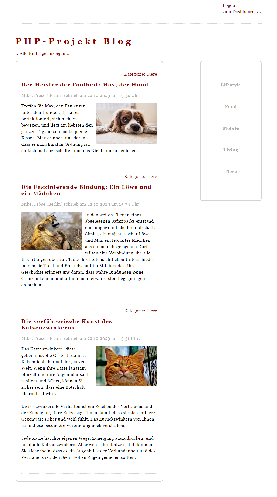
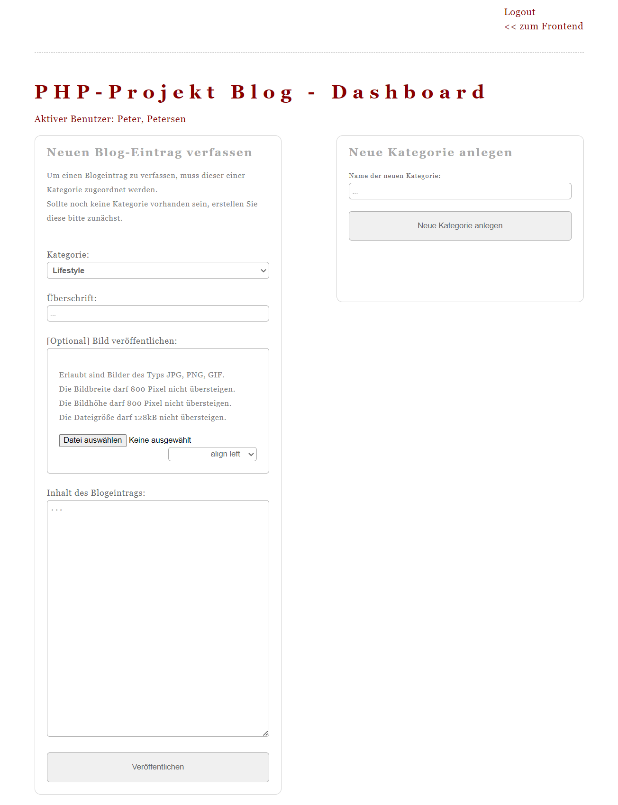

# PHP BLOG - OOP

Dieser **BLOG** wurde im Rahmen meiner Projektarbeit entwickelt, für die ich 4 Tage zur Verfügung hatte. Die Implementierung folgte den Prinzipien von Clean Code und orientierte sich an der objektorientierten Programmierung (OOP).

## Screenshots



## Systemanforderungen 🔧
Um den PHP-Blog auszuführen, benötigen Sie Folgendes:
- PHP-Unterstützung auf Ihrem Webserver
- MySQL-Server für die Datenbank

## Installation 🔌
Befolgen Sie diese Schritte, um den Blog auf Ihrem eigenen Server zu installieren:

1. Laden Sie die Repository-Daten herunter, indem Sie den folgenden Befehl ausführen:
   ```shell
   git clone https://github.com/mikework24/blog.git
   ```

2. Übertragen Sie die heruntergeladenen Daten auf Ihren Webserver, der PHP und MySQL unterstützt.

3. Importieren Sie die bereitgestellte Datenbank auf Ihrem Server.

4. Rufen Sie die entsprechende URL auf, um den Blog anzuzeigen.

Adminzugang
Email: admin@admin.com
Passwort: 1234

## Demo
In der Demo-Version können keine Einträge gespeichert werden. Um eigene Beiträge zu erstellen, müssen Sie den Blog auf Ihrem eigenen Server bereitstellen.

Probieren Sie den Blog hier aus:
- [Demo Blog](https://blog.mike-work.com/)